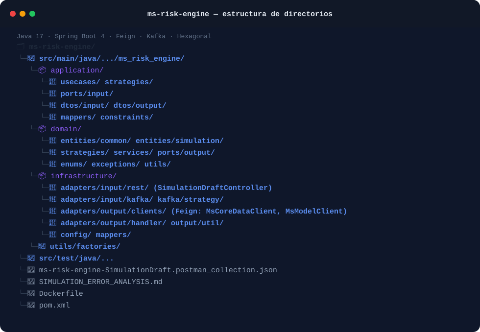

# ms-risk-engine

**Risk-calculation orchestration microservice for the RIntellix credit-risk platform.**

`Java 17` · `Spring Boot 4` · `OpenFeign` · `Apache Kafka` · `Hexagonal Architecture`

---

## 1. Overview

`ms-risk-engine` is the orchestrator of a credit-risk simulation. It does not compute the
probability of default itself (that is delegated to `ms-model`); instead it coordinates the
whole simulation flow: it validates the incoming draft, fetches request data, calls the ML
scoring service, applies risk-calculation strategies per product type, and publishes the final
scoring result back to `ms-core-data` for persistence.

Responsibilities at a glance:

- Expose the endpoint that starts a new simulation draft.
- Retrieve request/scoring context from `ms-core-data`.
- Call `ms-model` to obtain the PD (probability of default) prediction and its SHAP explanation.
- Apply product-specific risk strategies (e.g. revolving credit cards vs. term loans).
- Publish the resulting scoring event to Kafka for `ms-core-data` and `ms-reporting` to consume.

## 2. Key aspects of the system

- **Hexagonal architecture (ports & adapters).** `domain` holds entities, strategies and
  services with zero framework dependencies; `application` holds use cases, input ports and
  DTOs; `infrastructure` holds REST/Kafka adapters, Feign clients and configuration.
- **Strategy pattern for risk calculation.** `domain/strategies` (and its infrastructure Kafka
  counterpart in `infrastructure/adapters/input/kafka/strategy`) implements one strategy per
  credit product — e.g. `RevolvingCreditCardRiskCalculationStrategy` — so new product types can
  be added without touching existing calculation logic.
- **Declarative HTTP clients (Feign).** `infrastructure/adapters/output/clients` contains
  `MsCoreDataClient` (reads request/scoring data) and `MsModelClient` (calls the ML prediction
  endpoint), keeping outbound integration code declarative and testable.
- **Event-driven result propagation.** Once a simulation is scored, the result is emitted over
  Kafka rather than through a synchronous call, decoupling the engine from its downstream
  consumers.
- **Isolated error handling.** `infrastructure/adapters/output/handler` centralises how failures
  from downstream calls (Feign, Kafka) are translated into domain-level outcomes.

### Main REST resource

| Resource | Path | Notes |
|---|---|---|
| Simulation draft | `POST /api/v1/simulations/draft` | Starts a new risk-simulation flow |


### Repository structure

The following schematic illustrates the source code layout and how the key architectural pieces described above map to the main project folders:



## 3. Tech stack

- **Language / runtime:** Java 17
- **Framework:** Spring Boot 4 (`spring-boot-starter-web`, `spring-boot-starter-webflux`,
  `spring-boot-starter-validation`, `spring-boot-starter-actuator`, `spring-boot-starter-logging`)
- **Inter-service calls:** Spring Cloud OpenFeign (`spring-cloud-starter-openfeign`)
- **Messaging:** `spring-kafka`
- **Utilities:** Lombok, Jackson

## 4. Prerequisites

- JDK 17+
- Maven 3.9+

## 5. Getting started

> `**IMPORTANT**`
>
> **Global platform deployment**:
> This repository contains only the risk engine code. To spin up the entire RIntellix platform (including this service, Kafka, Keycloak, and the rest of the microservices), clone the main infrastructure repository **[TFG-RIntellix/rintellix-deployment]** and follow its instructions.

The following commands are provided for local development, code review, and testing:

```bash
# 1. Clone the repository
git clone https://github.com/TFG-RIntellix/ms-risk-engine.git
cd ms-risk-engine

# 2. Build and run local tests
mvn clean test
```

## 6. Configuration

The following properties are consumed via `application.yaml` or corresponding environment variables:

| Property | Description | Default |
|---|---|---|
| `app.clients.core-data.url` | Base URL of the Feign client for `ms-core-data` | `http://localhost:8081` |
| `app.clients.model.url` | Base URL of the Feign client for `ms-model` | `http://localhost:8000` |
| `spring.kafka.bootstrap-servers` | Kafka broker bootstrap servers | `localhost:9092` |
| `app.kafka.topics.scoring-result` | Topic where the scoring result is published | `risk.scoring.result` |
| `server.port` | Internal port the service listens on | `8082` |

See `SIMULATION_ERROR_ANALYSIS.md` in this repository for a breakdown of known failure modes in the simulation flow and how they are currently handled.

## 7. Related services

- **ms-core-data** — provides request data and persists the final scoring result.
- **ms-model** — provides the ML probability-of-default prediction and SHAP explanation.
- **ms-reporting** — consumes the scoring event to generate the credit report.
- **ms-sec-gateway** — routes external traffic to this service.

## 8. Author

Lucía Fernández Mancebo — TFG *RIntellix*, Universidad de Cantabria.


